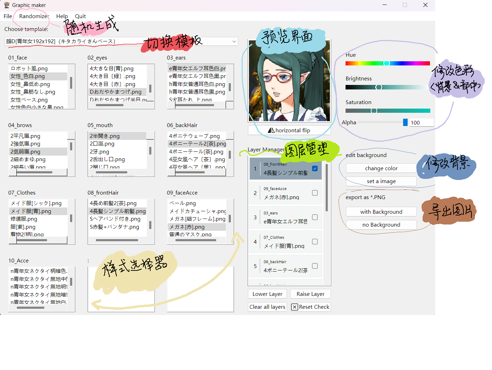
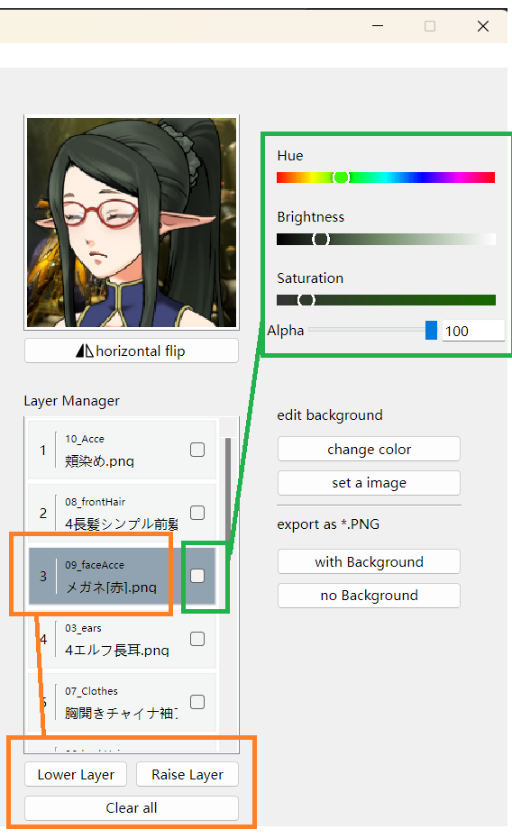

<h2>**跪求跳转到网页端查看**</h2>

[使用指南网页版链接](https://github.com/YZhou0413/Graphicmaker/blob/main/Guide.md)

## 1. 操作界面

## 2. 使用方法
#### 2.1 图层管理
##### 2.1.1 显示
1. 图层显示逻辑为：图层显示顺序为样式选择器被点击的顺序，最先被点击的样式会显示在列表的最底端，即最底层图层；最后被点击的图层会显示在最顶端。
2. 列表中左侧数字为图层编号，数字越小图层位置越靠近顶端。
3. 顶部小字为部件所属类别名称。
4. 中部较大字体为图片文件名。
5. **注意：右侧复选框用于调整颜色而非调整图层。**

##### 2.1.2 移动图层
有两种方法可以移动图层：
1. 点击你想移动的图层（请点击橙色方框内的部分），然后使用 “上移（raise）” 或 “下移（lower）” 按钮，一次会移动一个图层。
2. 点击你想移动的图层，拖动到想替换的位置（比如将3号图层拖到5号图层上）。这一操作将会将这两个位置上的图层互换。**非常不推荐使用这种方法，可能导致图层丢失或者影响色彩调整**。
##### 2.1.3 移除图层
1. 如果要移除单个图层，可以在对应选择器中选择 “None”。
2. 要移除全部图层，请点击 “清除全部（clear all）”。
##### 2.x 水平翻转图片
图层管理器上方长条按钮用于水平翻转图片，水平翻转效果也会应用到被保存的图片中。
#### 2.2 修改部件颜色
1. 如果想要修改图片颜色，可以点击相应图层图上绿框内的复选框。然后在右侧的调色区域内进行调整。
2. 可以同时勾选多个图层，同步改变色彩
3. 如果想停止修改某个图层的颜色，请取消勾选
4. 如果想重置某个部件的颜色，可以在对应类别内选择任意其他图片再重新选择原图片
5. **重要：非常建议在重置颜色前取消勾选再选择其他图片，否则可能重置后即使未勾选颜色还是会变。这种情况下可以再点击两次复选框停止修改该图片颜色**
#### 2.3 修改背景

背景默认为灰色，可以将背景修改为其他颜色、调整透明度或者修改为其他图片
1. 如果要修改背景颜色，请点击图上浅绿框内按钮 “change color”，按钮被选中时可以使用调色功能。调色完成后再点击同一按钮即可停止修改背景颜色。
2. 背景颜色和普通部件颜色可以被同时修改。
3. 点击 “set a image”按钮可以设置一张自定义图片作为背景。所选图片将会被裁切为正方形并调整到192x192的大小。
#### 2.4 导出图片
标题为 “export as .png”的部分的两个按钮负责导出图片。二者的区别是导出的图片中是否包含背景（第一个含背景，第二个不含）。请在弹出的文件管理器内选择保存到哪个文件夹并为图片命名，图片将被保存为png格式。

#### 2.5 使用自定义素材
**程序初始化时默认读取同文件夹下的 “Assets” 文件夹，请不要删除这一文件夹否则会导致程序无法启动**
如果要使用其他文件夹，请在程序左上角工具栏中选择 “File” -> “open folder”，然后选择你想打开的文件夹。
自定义素材建议使用192x192大小的png文件，否则无法正确处理。

**❗资源文件夹需按以下结构被保存否则无法正确载入图片：主文件夹->模板文件夹->部件类别文件夹->单个部件图片。**
请看图示或者参照示例文件夹“Assets”。

如果您的自定义素材中有某些部件由两张图片组成，需要同时载入两张图片（比如眼球和眼眶），请将图片按所示规则命名：
**底层图片（比如眼眶）：眼睛$.png / 上层图片（比如眼球）：眼睛.png**

底层图片的文件名末尾加一个“$（美元符号）”

## 3. Bug反馈 / 支持
如果在使用过程中遇到恶性bug请在Github项目的Issue栏目留言反馈，其他问题也欢迎在Github留言。

## 4. 声明
本操作指南中所使用的图片素材以及压缩包中的示例图片素材均来源于Silver Second老师的[素材包](https://silversecond.com/WolfRPGEditor/Download.html#0)。（如何修复图片资源请看[我的图片名是乱码，怎么办](FixPic.md)）

程序中按钮Icon图片素材来自于[Bootstrap图标库](https://icons.bootcss.com/)

程序本体免费配布，禁止转卖！！！也禁止打包其他资源转卖！！！

如果你在非本人Github页面以外其他地方免费或者花钱获取了本程序，本人不对其安全性和完整性承担任何责任。

 

感谢您读到这里。